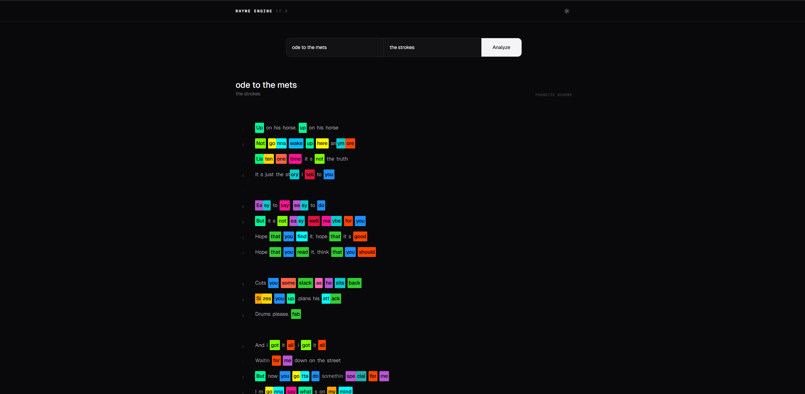

# Lyric Rhyme Analyzer

<!--  -->

The Lyric Rhyme Analyzer is a simple web app built with FastAPI
 and React that fetches song lyrics from the LRCLIB and analyzes the rhyming patterns in the lyrics. It highlights rhyming words in different colors and displays groups of rhyming words/syllables, making it easy to see the structure and patterns in song lyrics.  
This was inspired by Genius' Highlighted series, where this highlighting is done by professional musicians and rap connoisseurs.

Note that language is fluid; artists often slant their pronunciations to fit a specific scheme. Because of this, the analysis may not be 100% perfect, as it struggles to account for individual artistic inflection.
  
